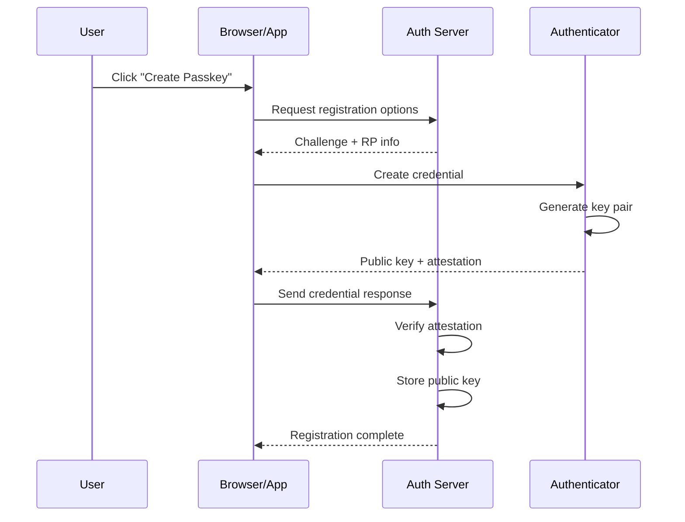
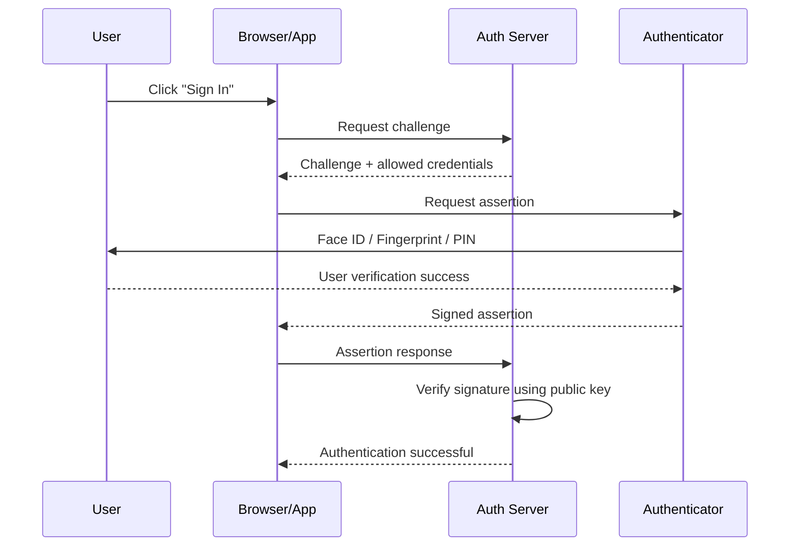
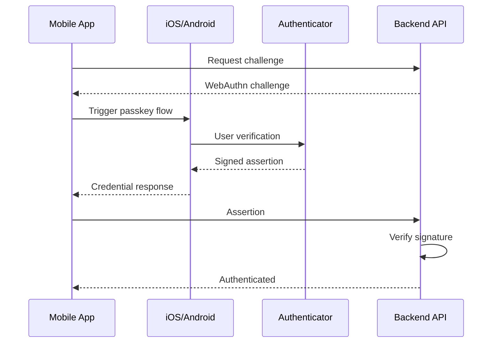

Passkeys are quickly becoming the new standard for authentication.

Apple, Google, Microsoft, Okta, GitHub, Amazon, PayPal, and hundreds of other platforms are now moving users away from passwords toward phishing-resistant authentication built on WebAuthn and FIDO2.

But despite the marketing around "passwordless login," many engineers and security teams still don't fully understand what's actually happening underneath.

This article breaks down:

- What passkeys really are
- How WebAuthn works
- Why passkeys are phishing-resistant
- The difference between platform and roaming authenticators
- Registration and authentication flows
- Common implementation mistakes
- Mobile app considerations
- Attack scenarios and limitations

---

## What Is a Passkey?

A passkey is a cryptographic credential stored on a device and used to authenticate a user without requiring a password.

Unlike passwords:

- Passkeys cannot be reused across websites
- Secrets are never shared with the server
- Users cannot accidentally type them into phishing pages
- Credential theft databases become mostly useless

Under the hood, passkeys are built on:

| Technology | Purpose |
|---|---|
| WebAuthn | Browser/API standard |
| CTAP | Communication protocol with authenticators |
| FIDO2 | Umbrella authentication framework |
| Public Key Cryptography | Authentication mechanism |

At a high level:

```text
Server stores:      Public Key
User device stores: Private Key
```

The private key never leaves the user's device.

That changes everything.

---

## Why Passwords Are Fundamentally Broken

Passwords fail because humans are part of the authentication protocol.

Common issues:

```text
PASSWORD PROBLEM                 RESULT
────────────────────────────────────────────────
Password reuse                   Credential stuffing
Weak passwords                   Brute force attacks
Phishing                         Account takeover
Shared secrets                   Database breach impact
SMS OTP                          SIM swap attacks
Push fatigue                     MFA bypass attacks
```

Passkeys eliminate most of these classes entirely.

---

## The Core Security Model

Traditional authentication:

```text
User → sends shared secret → Server
```

Passkey authentication:

```text
User Device → signs challenge → Server verifies signature
```

The server never receives the private key.

Even if the server database is breached:

- Attackers only steal public keys
- Public keys cannot authenticate users
- Password cracking becomes irrelevant

---

## Registration Flow (Passkey Creation)

When a user creates a passkey, the device generates a new public/private key pair.

### Sequence Diagram



### What Happens Internally

#### Step 1 — Server Generates Challenge

The server creates:

- A random cryptographic challenge
- Relying Party (RP) information
- User identifier
- Allowed algorithms

Example:

```json
{
  "challenge": "base64-random-value",
  "rp": {
    "name": "Example App",
    "id": "example.com"
  },
  "user": {
    "id": "12345",
    "name": "user@example.com"
  }
}
```

---

#### Step 2 — Authenticator Generates Key Pair

The authenticator:

- Creates a unique private key
- Creates a matching public key
- Binds the credential to the RP ID

This is critical:

```text
Credential for example.com
≠
Credential for evil-example.com
```

The browser enforces origin matching.

That's what makes phishing resistance possible.

---

#### Step 3 — Server Stores Public Key

The server stores:

```text
User ID
Credential ID
Public Key
Counter / Metadata
```

The private key remains securely stored on the user device.

---

## Authentication Flow (Login)

Logging in with a passkey is fundamentally different from password authentication.

### Sequence Diagram



---

## Why Passkeys Are Phishing-Resistant

This is the most important property of passkeys.

With passwords:

```text
User can type password into fake site
```

With passkeys:

```text
Authenticator checks domain automatically
```

Example:

| Legitimate Site | Phishing Site |
|---|---|
| github.com | github-login-security.com |

The authenticator refuses to sign challenges for the phishing domain because the RP ID does not match.

The user never sees or types the credential.

That breaks traditional phishing.

---

## WebAuthn Components Explained

### Relying Party (RP)

The application requesting authentication.

Examples:

- github.com
- google.com
- yourbank.com

---

### Authenticator

The component storing and using the private key.

Types:

| Authenticator Type | Example |
|---|---|
| Platform | Face ID, Windows Hello |
| Roaming | YubiKey |
| Hybrid | Phone as passkey provider |

---

### Client

Usually:

- Browser
- Mobile application
- Operating system layer

The client communicates between:

```text
Application ↔ Authenticator
```

---

## Platform vs Roaming Authenticators

### Platform Authenticators

Built into the device.

Examples:

- Apple Face ID
- Android biometrics
- Windows Hello

Advantages:

- Excellent UX
- Fast authentication
- Strong hardware protection

Disadvantages:

- Device ecosystem dependency

---

### Roaming Authenticators

Portable external authenticators.

Examples:

- YubiKey
- Security keys
- NFC tokens

Advantages:

- Portable
- Hardware isolated
- Enterprise friendly

Disadvantages:

- Users can lose them
- Additional hardware cost

---

## Multi-Device Passkeys

Modern passkeys can sync across ecosystems.

Examples:

- iCloud Keychain
- Google Password Manager
- Microsoft account sync

This improves usability dramatically.

However, it also changes the threat model.

```text
Traditional security key:
Private key bound to one device

Synced passkey:
Credential replicated securely across trusted ecosystem
```

Security now depends partly on the cloud ecosystem protecting synced credentials.

---

## User Verification vs User Presence

These are commonly confused.

| Term | Meaning |
|---|---|
| User Presence (UP) | User interacted with device |
| User Verification (UV) | User identity verified |

Examples:

```text
Touching security key = User Presence
Fingerprint scan      = User Verification
```

High-security applications should require UV.

---

## Mobile Application Passkeys

Native mobile apps use WebAuthn differently from browsers.

### Typical Mobile Flow



Important considerations:

- Associated domains / asset links must be configured correctly
- RP IDs must match exactly
- Device biometrics may behave differently on simulators
- Push-based authenticators are different from passkeys

---

## Passkeys vs Push Authentication

These are not the same thing.

| Passkeys | Push Authentication |
|---|---|
| Cryptographic signing | Approve/Deny workflow |
| Phishing-resistant | Vulnerable to push fatigue |
| Browser/API standard | Vendor-specific |
| Private key auth | Session approval |
| WebAuthn/FIDO2 | Mobile push channel |

Many organisations confuse these concepts.

A push MFA authenticator is not automatically phishing-resistant.

---

## Common Implementation Mistakes

### 1. Weak RP ID Configuration

If RP IDs are misconfigured:

```text
login.example.com
vs
example.com
```

Authentication may fail unexpectedly.

---

### 2. Falling Back to Weak Authentication

Example:

```text
Passkey fails
→ fallback to SMS OTP
→ attacker targets weaker path
```

Security becomes:

```text
Strongest method ≠ Actual security
Weakest fallback = Actual security
```

---

### 3. Broken Origin Validation

Origin validation mistakes can destroy phishing resistance.

The server must validate:

- Origin
- RP ID
- Challenge
- Signature
- Credential ownership

---

### 4. Improper Challenge Handling

Challenges must be:

- Random
- Short-lived
- Single-use

Otherwise replay attacks become possible.

---

## Attack Scenarios Against Passkeys

Passkeys significantly reduce risk, but no authentication system is perfect.

### Possible Attacks

| Attack | Status |
|---|---|
| Credential stuffing | Prevented |
| Traditional phishing | Prevented |
| Password reuse | Eliminated |
| Database breach replay | Prevented |
| Push fatigue | Not applicable |
| Session theft | Still possible |
| Malware on endpoint | Still possible |
| Evil proxy downgrade attacks | Possible if fallback exists |

---

## What Happens During Signature Verification

At login:

```text
Server challenge
→ signed with private key
→ verified using public key
```

Mathematically:

```text
verify(
  public_key,
  signed_challenge,
  original_challenge
)
```

If valid:

```text
User possesses correct private key
```

Without ever revealing it.

---

## Why This Matters for Modern Identity Security

Authentication attacks are evolving rapidly:

- AI-assisted phishing
- Adversary-in-the-middle kits
- MFA fatigue attacks
- Session hijacking malware
- OAuth token theft

Passwords and SMS OTPs are increasingly inadequate.

Passkeys represent one of the largest authentication architecture shifts in decades because they fundamentally remove the shared secret model.

That changes:

- Phishing economics
- Credential theft markets
- Password reset abuse
- MFA bypass attack paths

---

## Enterprise Adoption Challenges

Despite the benefits, enterprises still face challenges:

| Challenge | Impact |
|---|---|
| Legacy systems | Cannot support WebAuthn |
| User education | Confusion around passkeys |
| Cross-platform sync | Ecosystem fragmentation |
| Recovery flows | Complex account recovery |
| Shared accounts | Operational difficulty |
| Mobile app integration | Additional implementation work |

Most organisations will operate hybrid authentication models for years.

---

## Recommended Architecture

A modern authentication stack should ideally look like this:

```text
PRIMARY AUTH
├── Passkeys / WebAuthn
├── Hardware-backed credentials
└── Device-bound authentication

RECOVERY
├── Recovery codes
├── Verified device recovery
└── Strong identity proofing

DEFENSE-IN-DEPTH
├── Risk engines
├── Device binding
├── Session monitoring
├── Behavioral analytics
└── Conditional access
```

---

## Final Thoughts

Passkeys are not just "passwords but easier."

They fundamentally replace shared-secret authentication with cryptographic proof-of-possession.

That shift:

- Reduces phishing dramatically
- Eliminates password reuse
- Minimises breach impact
- Improves UX simultaneously

For security teams, passkeys are one of the few rare cases where usability and security both improve together.

For attackers, they remove some of the most scalable and profitable attack techniques on the internet.

And for developers, understanding WebAuthn is quickly becoming as important as understanding OAuth.
